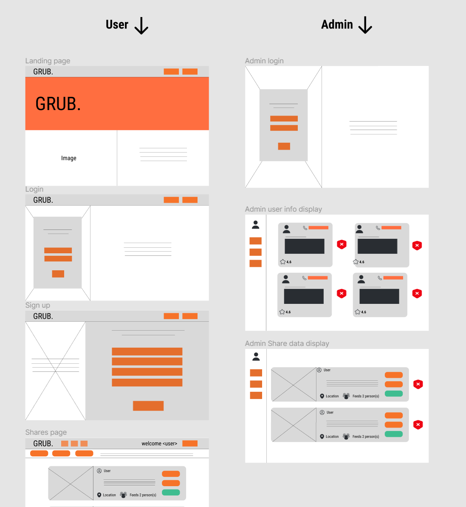
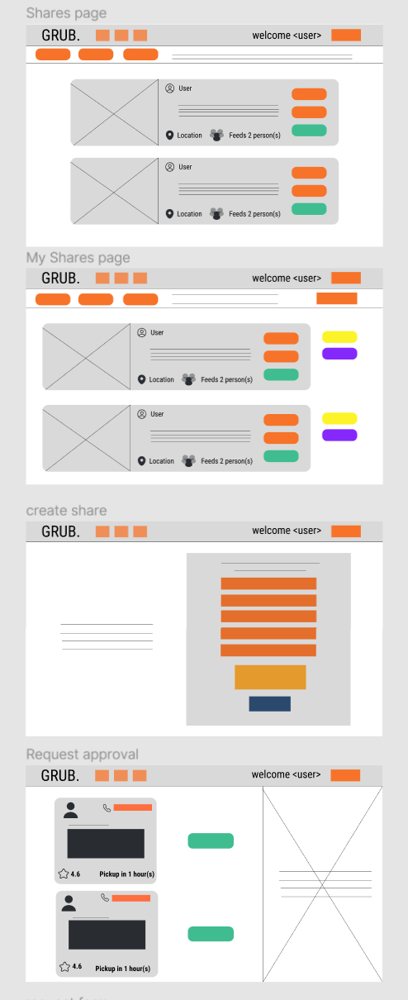
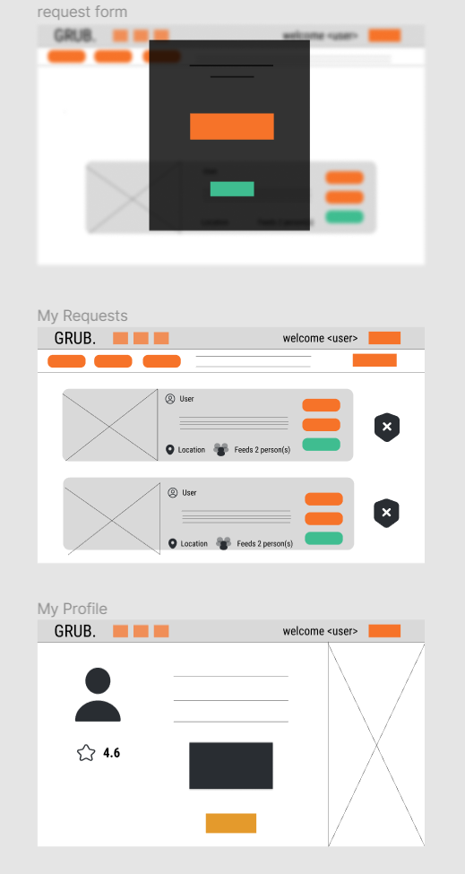

Backend APIS for a food share platform. Previously Hosted on AWS using the follwing services:
ECS using EC2 instances for the docker container
EC2 Auto Scaling
Image uploaded on ECR
Multi-AZ Deployment

Follwing are the wireframes for the intended frontend if anyone would be kind enough to contribute. My aim with the project was to create hosted, scalable, APIs written using best practices on .NET core 7

